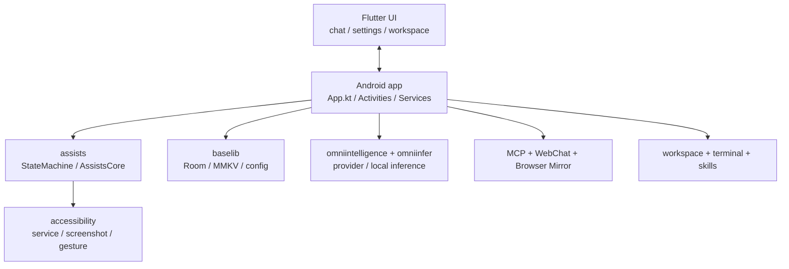

# Architecture

This page looks at the project from the runtime chain perspective.

## High-level relationship map

## 1. Application bootstrap layer

`app/src/main/java/cn/com/omnimind/bot/App.kt` is the main composition point. It currently handles:

- `MMKV` initialization
- `DatabaseHelper.init(this)`
- `OmniInferServer.init(this)`
- local model readiness bridging
- `AgentWorkspaceManager.ensureRuntimeDirectories()`
- built-in skill seeding
- AI config sync
- workspace memory rollup scheduling
- scheduled task restoration
- `McpServerManager.restoreIfEnabled(this)`
- `EmbeddedTerminalRuntime.warmup(this)`

## 2. Execution orchestration layer

The `assists` module is one of the most important layers in the project.

### `StateMachine`

Its responsibilities include:

- initializing the accessibility controller
- starting tasks
- finishing companion tasks
- canceling chat tasks
- receiving user input for running VLM tasks
- appending external memory and priority events
- reading, running, and canceling scheduled tasks

### `AssistsCore`

This is the public façade used by upper layers. Flutter and native UI do not need to know every task detail to trigger and manage execution.

## 3. Perception and action layer

The `accessibility` module turns system abilities into callable actions:

- reading `AccessibilityNodeInfo`
- gesture click
- text input
- scrolling
- launching apps
- screenshots
- screen-state monitoring

This is the layer that determines whether the AI can actually act.

## 4. Data and state layer

There are currently at least two kinds of local persistence:

### Room

`AppDatabase` currently includes entities such as:

- `Conversation`
- `Message`
- `AgentConversationEntry`
- `TokenUsageRecord`
- `ExecutionRecord`
- `FavoriteRecord`
- `StudyRecord`
- `CacheSuggestion`
- `AppIcons`

### MMKV

MMKV is better suited for:

- MCP enablement, host, port, and token
- UI-side preference toggles
- lightweight, frequently updated configuration

## 5. Flutter UI layer

The UI layer does more than render screens. It already carries product-level logic for:

- provider profile management
- scene model bindings
- memory document editing
- skill store flows
- workspace browsing
- MCP configuration
- local model download and status display

The main route registration lives in `ui/lib/features/home/router_config.dart`.

## 6. Flutter Web bundle embedding

`app/build.gradle.kts` also defines an easy-to-miss path:

- build `ui/lib/web_main.dart`
- generate a Flutter Web bundle
- copy it into Android assets under `flutter_web`

So the Android app build also packages the WebChat-related web assets.

## 7. Why the workspace structure matters

The workspace is not only a file browser. It is the stable on-device home for the agent:

- `SOUL.md`
- `CHAT.md`
- `MEMORY.md`
- short-memory directories
- model directories
- attachments, browser, skills, shared, and related folders

That is part of what lets Omnibot evolve from one-off execution into ongoing collaboration.
