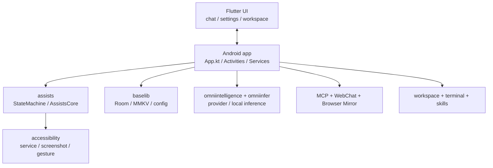

# 架构参考

这一页从“运行时链路”角度看整个工程。

## 总体关系图

## 1. Application 启动层

`app/src/main/java/cn/com/omnimind/bot/App.kt` 是全局装配点。它当前负责：

- `MMKV` 初始化
- `DatabaseHelper.init(this)`
- `OmniInferServer.init(this)`
- 本地模型准备桥接
- `AgentWorkspaceManager.ensureRuntimeDirectories()`
- 内置技能种子写入
- AI 配置同步
- workspace memory rollup 调度
- scheduled task 恢复
- `McpServerManager.restoreIfEnabled(this)`
- `EmbeddedTerminalRuntime.warmup(this)`

## 2. 执行编排层

`assists` 模块是核心中的核心。

### `StateMachine`

职责包括：

- 初始化无障碍控制器
- 启动任务
- 终止 companion task
- 取消 chat task
- 提供用户输入给运行中的 VLM 任务
- 写入外部记忆和优先事件
- 读取、执行、取消计划任务

### `AssistsCore`

它是给外部层用的统一门面，Flutter / 原生 UI 不需要直接深入任务细节就能发起和控制执行。

## 3. 感知与动作层

`accessibility` 模块负责把系统能力变成可调用动作：

- 读取 `AccessibilityNodeInfo`
- 手势点击
- 文本输入
- 滚动
- 启动应用
- 截图
- 屏幕状态监听

这层决定了“AI 会不会真的动手”。

## 4. 数据与状态层

本地持久化当前至少有两类：

### Room

`AppDatabase` 当前实体包含：

- `Conversation`
- `Message`
- `AgentConversationEntry`
- `TokenUsageRecord`
- `ExecutionRecord`
- `FavoriteRecord`
- `StudyRecord`
- `CacheSuggestion`
- `AppIcons`

### MMKV

适合存储：

- MCP 开关和端口
- Token
- UI 侧即时配置
- 轻量状态

## 5. Flutter UI 层

UI 层当前不是“页面展示层”这么简单，而是实际承接了很多产品逻辑：

- 模型 provider 管理
- 场景模型绑定
- 记忆文档编辑
- 技能商店
- 工作区浏览
- MCP 服务配置
- 本地模型下载与状态展示

核心路由集中在 `ui/lib/features/home/router_config.dart`。

## 6. Flutter Web bundle 嵌入

`app/build.gradle.kts` 里还有一条经常被忽略的链路：

- 构建 `ui/lib/web_main.dart`
- 输出 Flutter Web bundle
- 同步到 Android assets 的 `flutter_web`

也就是说，宿主 APK 构建时会把 web chat 相关资源一起打进去。

## 7. 工作区结构为什么重要

工作区不只是“给用户看文件”，它还是 Agent 的稳定落盘空间。默认会维护：

- `SOUL.md`
- `CHAT.md`
- `MEMORY.md`
- 短期记忆目录
- 模型目录
- 附件 / browser / skills / shared 等目录

这也是 Omnibot 能逐渐从“单次执行”走向“持续协作”的基础。
